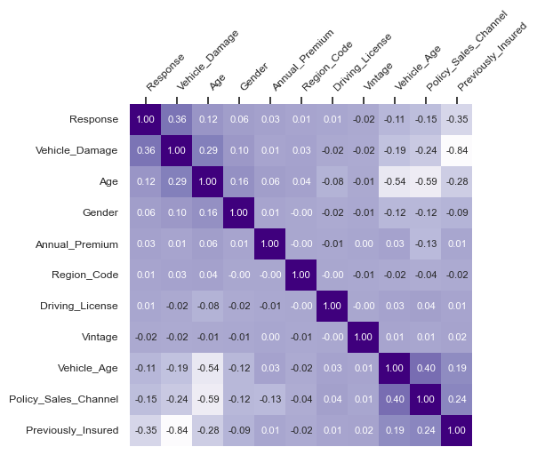
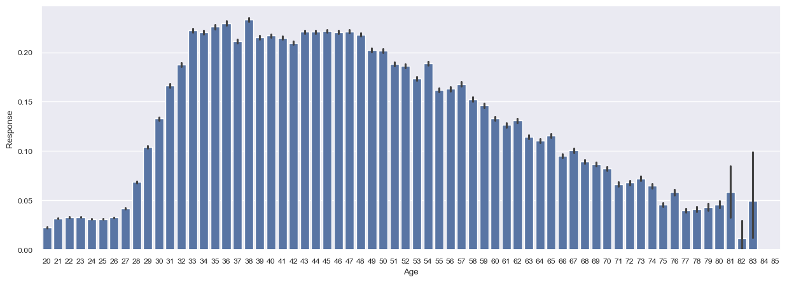
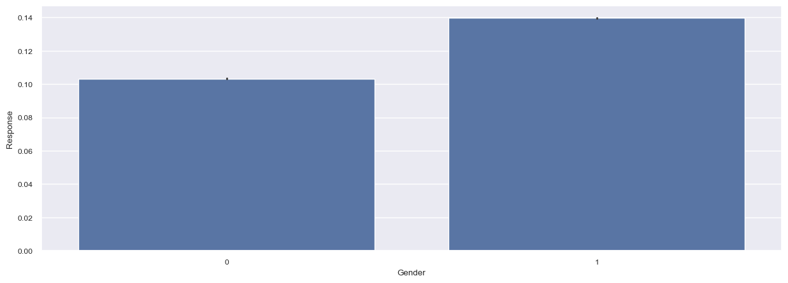
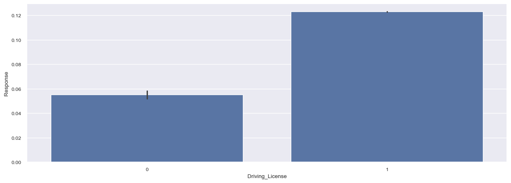
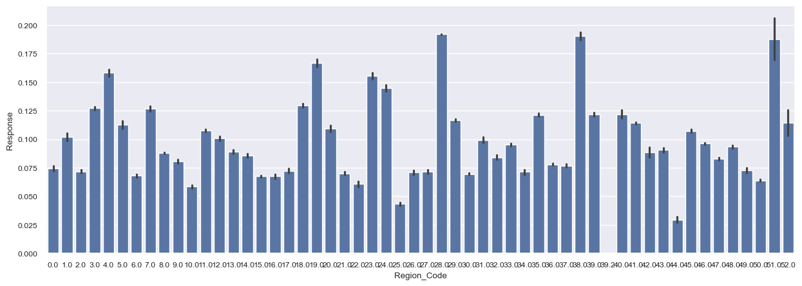
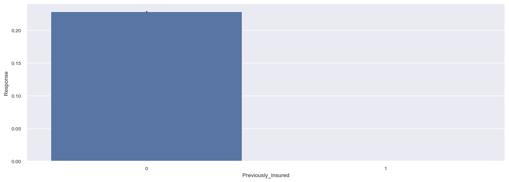
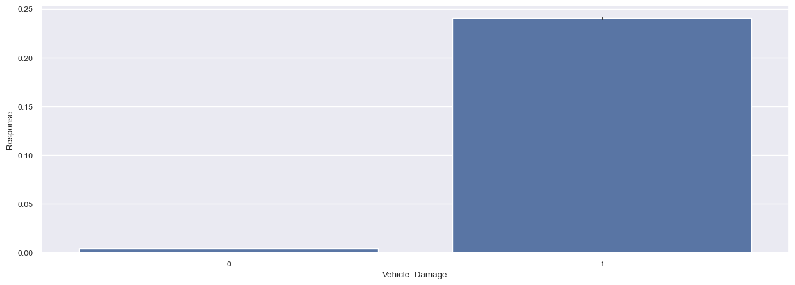
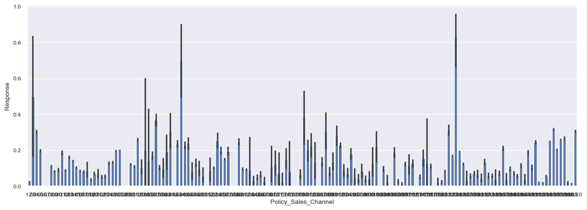
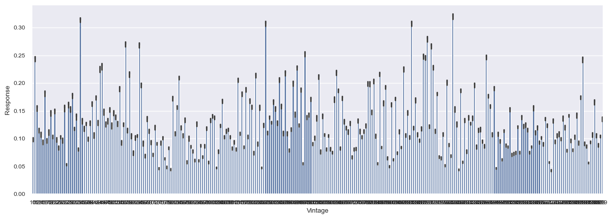

# 2024-Binary-Classification-of-Insurance-Cross-Selling

2024 kaggle playground "Binary Classification of Insurance Cross Selling"

### Result of the contest

rank: 81st place  
score: 0.89688

## Table of the contents

[**Competition data**](#1-competition-data)  
[**Baseline code**](#2-baseline-code)  
[**Required libraries**](#3-required-libraries)

## Competition data

[**Competition data link**](https://www.kaggle.com/competitions/playground-series-s4e7/)

## EDA(Exploratory Data Analysis)

### Correlation

### Age

### Gender

### Driving License

### Region Code

### Previously Insured

### Vehicle_Damage

### Policy Sales Channel

### Vintage

